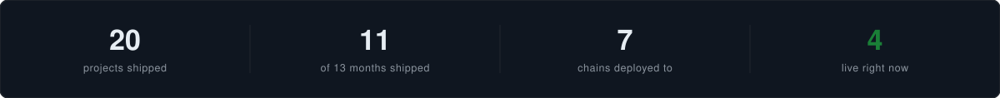
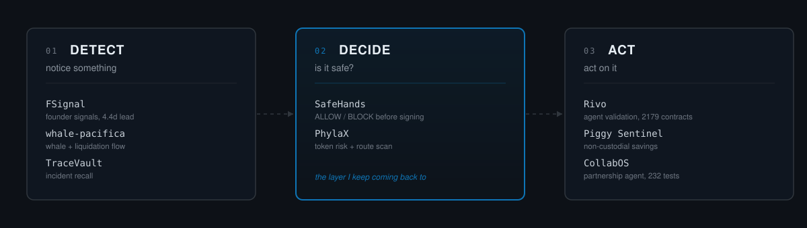
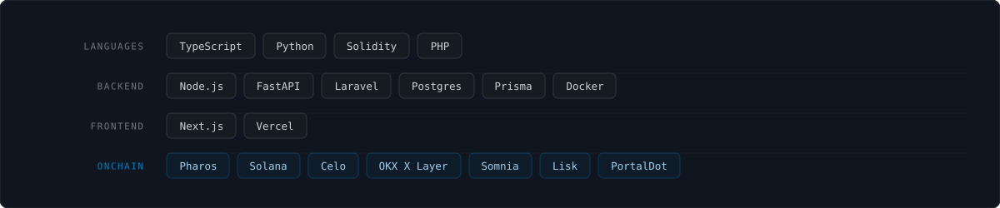

<picture>
  <source media="(prefers-color-scheme: dark)" srcset="assets/header-dark.svg">
  <source media="(prefers-color-scheme: light)" srcset="assets/header-light.svg">
  
</picture>

  

<picture>
  <source media="(prefers-color-scheme: dark)" srcset="assets/stats-dark.svg">
  <source media="(prefers-color-scheme: light)" srcset="assets/stats-light.svg">
  
</picture>

 

## How I think about the problem

These are separate projects, not one system — nothing flows between them. What connects them is the question each one answers. Grouping them this way is how I pick what to build next.

<picture>
  <source media="(prefers-color-scheme: dark)" srcset="assets/layers-dark.svg">
  <source media="(prefers-color-scheme: light)" srcset="assets/layers-light.svg">
  
</picture>

**Nothing should reach a wallet without a verdict first.** That is the line most of this work is drawn around.

 

## Flagship Infrastructure

<table bordercolor="#30363d">
  <tr>
    <td width="50%" valign="top">
      <h3 align="center"><a href="https://github.com/Rzbyte/safehands-pharos">SafeHands</a></h3>
      
<i>Transaction Firewall for AI Agent Finance</i>

      
A deterministic policy engine issuing <b>ALLOW / BLOCK</b> verdicts <i>before</i> a wallet signs. Ships as an MCP server, API, and npm package. Live on Pharos Pacific Mainnet.

      

        
        
        
        
      

    </td>
    <td width="50%" valign="top">
      <h3 align="center"><a href="https://github.com/Rzbyte/Rivo">Rivo</a></h3>
      
<i>Event Intelligence for DreamDEX</i>

      
Turns Event Contract probabilities into measurable intelligence. Calibration against <b>2,179 contracts</b>. Validates agents economically with on-chain testnet proof.

      

        
        
        
        
      

    </td>
  </tr>
  <tr>
    <td width="50%" valign="top">
      <h3 align="center"><a href="https://github.com/Rzbyte/FSignal">FSignal</a></h3>
      
<i>Ghost Signal Monitor</i>

      
Persistent Slack monitor tracking founders before the official directory lists them. Median lead time <b>4.4 days</b> with <b>&gt;= 90%</b> precision enforced in CI.

      

        
        
        
        
      

    </td>
    <td width="50%" valign="top">
      <h3 align="center"><a href="https://github.com/Rzbyte/PhylaX">PhylaX</a></h3>
      
<i>AI Execution Firewall</i>

      
Scans tokens for honeypot risk, fetches optimal DEX routes, and builds unsigned transactions for OKX X Layer. The server never broadcasts &mdash; signing stays with the user.

      

        
        
        
      

    </td>
  </tr>
  <tr>
    <td width="50%" valign="top">
      <h3 align="center"><a href="https://github.com/Rzbyte/PiggySentinel">Piggy Sentinel</a></h3>
      
<i>Autonomous Savings Agent on Celo</i>

      
Set a goal and a budget. Penny allocates into <b>Aave V3</b>, monitors, and rebalances. Non-custodial &mdash; it moves only within the on-chain allowance you set.

      

        
        
        
      

    </td>
    <td width="50%" valign="top">
      <h3 align="center"><a href="https://github.com/Rzbyte/TraceVault">TraceVault</a></h3>
      
<i>Vector Search for Incidents</i>

      
Paste an error, find the fix. Local embeddings via <code>all-MiniLM-L6-v2</code> and HNSW cosine search on Actian VectorAI DB. Runs fully offline.

      

        
        
        
      

    </td>
  </tr>
</table>

 

## Also Shipped

<table>
  <tr>
    <td valign="top" nowrap><b><a href="https://github.com/Rzbyte/vehicle-booking">vehicle-booking</a></b></td>
    <td>Fleet booking system delivered for a nickel mining company. Two-level approval workflow, usage analytics, Excel report export.</td>
    <td align="right" nowrap> </td>
  </tr>
  <tr>
    <td valign="top" nowrap><b><a href="https://github.com/Rzbyte/CollabOS">CollabOS</a></b></td>
    <td>Autonomous creator partnership director on Minds by Animoca Brands. <b>232 tests</b>, Playwright E2E against the live platform.</td>
    <td align="right" nowrap> </td>
  </tr>
  <tr>
    <td valign="top" nowrap><b><a href="https://github.com/Rzbyte/safehands-solana">safehands-solana</a></b></td>
    <td>SafeHands pre-execution policy engine ported to Solana.</td>
    <td align="right" nowrap> </td>
  </tr>
  <tr>
    <td valign="top" nowrap><b><a href="https://github.com/Rzbyte/whale-pacifica">whale-pacifica</a></b></td>
    <td>Whale activity and liquidation-cascade monitor for Pacifica perpetuals.</td>
    <td align="right" nowrap></td>
  </tr>
  <tr>
    <td valign="top" nowrap><b><a href="https://github.com/Rzbyte/recall-dashboard">recall-dashboard</a></b></td>
    <td><a href="https://recall-agent-dashboard.vercel.app">Live</a> dashboard tracking Recall Network agent decisions and outcomes.</td>
    <td align="right" nowrap></td>
  </tr>
</table>

 

## Stack

<picture>
  <source media="(prefers-color-scheme: dark)" srcset="assets/stack-dark.svg">
  <source media="(prefers-color-scheme: light)" srcset="assets/stack-light.svg">
  
</picture>

 

---

<i>Most things here were built under time pressure for a specific problem. The READMEs say what works and what doesn't.</i>

